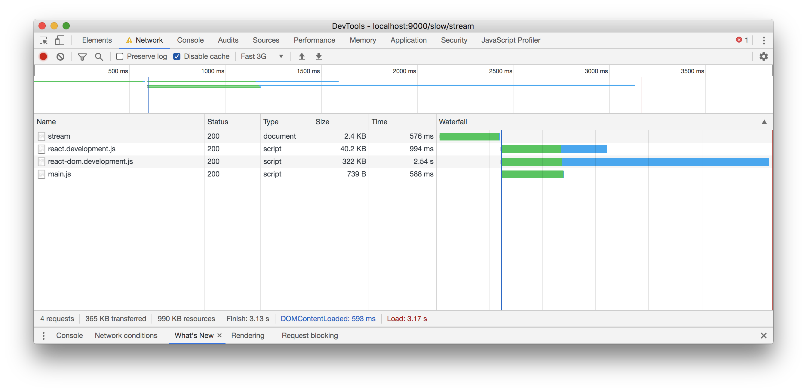
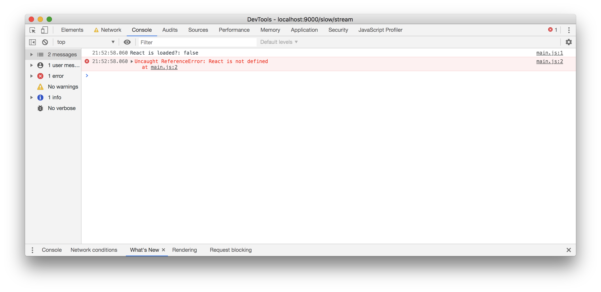
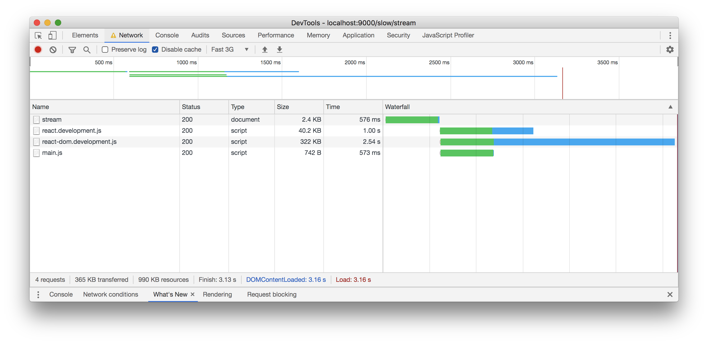
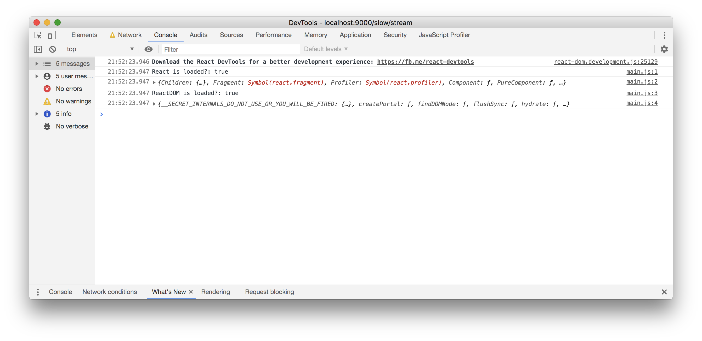
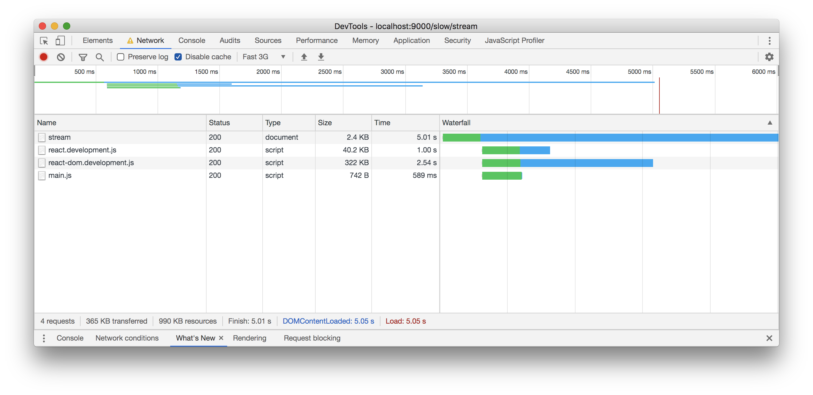
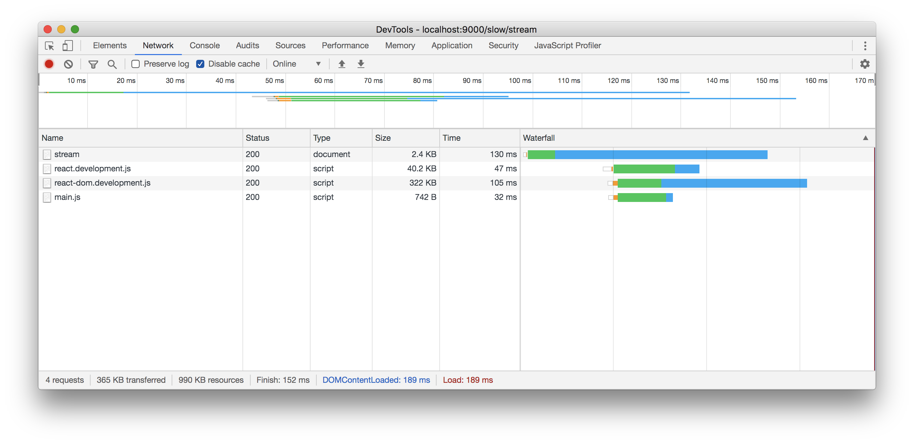
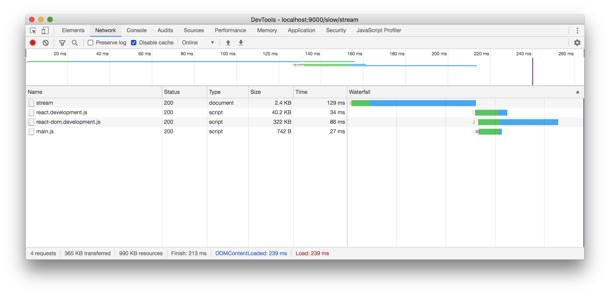
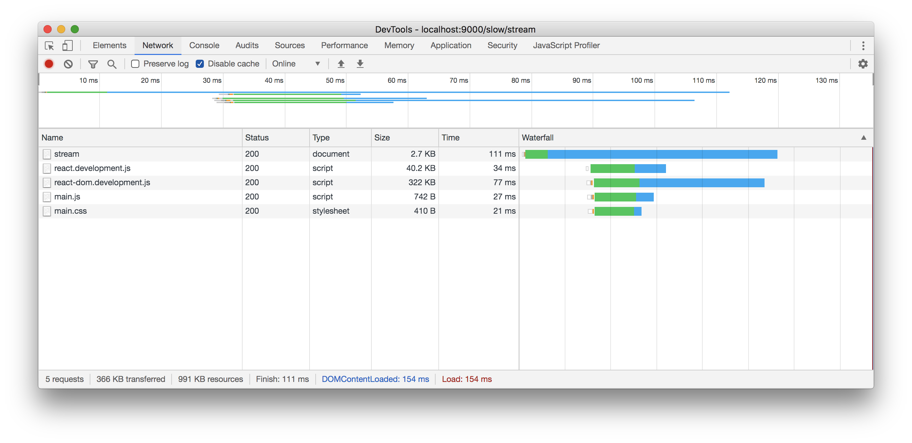

# フロントエンドのパフォーマンスを向上させるためにできること

## Usage

```
yarn start
```

## TTFB(Time to first byte)対策

* TTFB: <https://web.dev/time-to-first-byte/>

MiddlewareでHTMLレスポンスを`res.write`を利用して送出できるところから、送っていく戦略を取る。

最も単純な例は、`<!DOCTYPE html>`を真っ先に送ることである。

```html
<!-- 1. ここから他のMiddlewareに依存しないレスポンス -->
<!DOCTYPE html>
<!-- 1. ここまで他のMiddlewareに依存しないレスポンス -->
<!-- 2. ここからmiddlewareの処理に応じて変化する部分 -->
<html lang="ja">
  <head>
  </head>
<body>

</body>
</html>
<!-- 2. ここまでmiddlewareの処理に応じて変化する部分 -->
```

## Streamと動機処理の比較

* <http://localhost:9000/slow/sync>
* <http://localhost:9000/slow/stream>


## async, defer, preloadの設定

**Q. async属性を付けたscriptタグを以下のように定義して、`main.js`から`React`もしくは`ReactDOMを参照した場合、正しく利用できるだろうか？**

```html
<script async src="/assets/js/react.development.js"></script>
<script async src="/assets/js/react-dom.development.js"></script>
<script async src="/assets/js/main.js"></script>
```

**A. No**

Network performanceを`Fast 3G`として、headタグの末尾に記述して読み込んだ結果はこちら。（bodyタグの末尾でも同じ）






明らかに`react`と`react-dom`の`Content Download`時間が長く、`main.js`の実行までに読み込みが間に合っていない。

これでは文字通り使い物にならない。

**Q. すべてdeferタグをつければ、前問の参照問題は解決するのか？**

```html
<script defer src="/assets/js/react.development.js"></script>
<script defer src="/assets/js/react-dom.development.js"></script>
<script defer src="/assets/js/main.js"></script>
```

**A. Yes**





これは正しそうだ。

**Q. `head`タグに`defer`でscriptを読み込み、かつ、ReactやReactDOMのContents Loadよりサーバーのレスポンスが長い場合に`defer`タグだけで実行するの場合にロード時間を無駄なく利用できているか？**

**A. できていそう**

`React, ReactDOMのダウンロード時間 < サーバーのロード時間`が満たされている場合は十分そうである。



**Q. `defer`属性を付けたscriptの記述場所は`head`か`body`か？**

**A. headで読み込む場合はそのままでも良い。bodyに読み込む場合は、preloadを利用する**

**headタグ内に`<script defer>`を記述した場合**

```HTML
<head>
  <script defer src="/assets/js/react.development.js"></script>
  <script defer src="/assets/js/react-dom.development.js"></script>
  <script defer src="/assets/js/main.js"></script>
</head>
```



**bodyタグ内に`<script defer>`を記述した場合、かつ、サーバーのレスポンスが悪い場合**

```html
<body>
  <script defer src="/assets/js/react.development.js"></script>
  <script defer src="/assets/js/react-dom.development.js"></script>
  <script defer src="/assets/js/main.js"></script>
</body>
```



bodyタグが読み込まれるまで待つことになる。

**bodyタグ内に`<script defer>`を記述した場合、かつ、サーバーのレスポンスが悪い場合、かつ、preloadを指定した場合**

```html
<head>
  <link rel="preload" href="/assets/js/react.development.js" as="script">
  <link rel="preload" href="/assets/js/react-dom.development.js" as="script">
  <link rel="preload" href="/assets/js/main.js" as="script">
</head>
<body>
  <script defer src="/assets/js/react.development.js"></script>
  <script defer src="/assets/js/react-dom.development.js"></script>
  <script defer src="/assets/js/main.js"></script>
</body>
```



headタグの読み込みを長期のサーバーレスポンスを待たずして行うため、preloadが実行され、Contents loadが完了した状態でbodyタグが読み込まれる。

**Q. scriptを`defer`にしたときの弊害は？**

**A. deferはDOMが完全に読み終わってから実行されるため、asyncを付けた場合と比較して、scriptの実行までに時間がかかる**

|フラグ|実行タイミング|
|:----|:-----------|
|async|Contentが読み込み終わったたら実行する|
|defer|Contentが読み込み終わり、かつ、DOMが読み込み終わってから実行する|

初期ロードに必要なスクリプトのほとんどはdeferを付けておけばパフォーマンス的にも大丈夫であるが、
パフォーマンスが重視されるアプリケーションでより初期化のパフォーマンスを向上させたい場合に
`async`を利用して初期化、`defer`で初期化後の処理を実行を行うことになりそうだ。

[こちらの記事](https://qiita.com/phanect/items/82c85ea4b8f9c373d684)と同等の結論になった。
